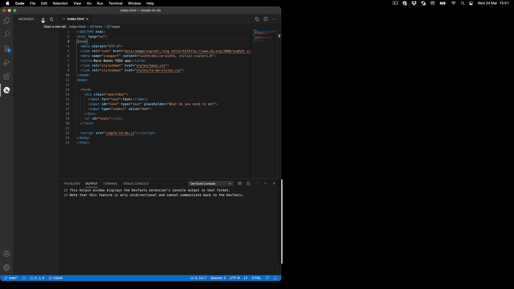
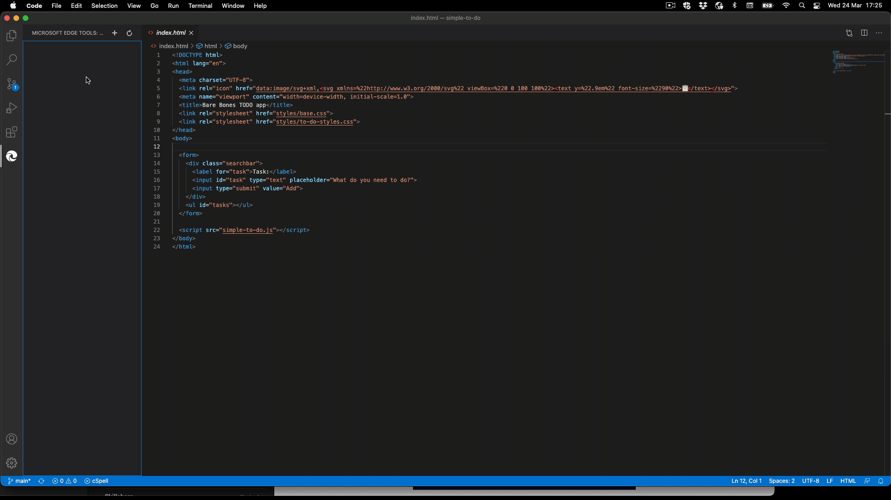

# Microsoft Edge Developer Tools for Visual Studio Code

**Show the browser's Elements and Network tool inside the Visual Studio Code editor and use it to fix CSS issues with your site and inspect network activity.**

A Visual Studio Code extension that allows you to use the browser's Elements and Network tool from within the editor. The DevTools will connect to an instance of Microsoft Edge giving you the ability to see the runtime HTML structure, alter layout, fix styling issues, read console messages and view network requests. All without leaving Visual Studio Code.

**Note**: This extension _only_ supports Microsoft Edge (version greater than 80.0.361.48)

You can use the extension either in an own window or embedded in your editor.

## Documentation

For more details on how to use and customize the extension, [refer to the documentation](https://microsoft.github.io/vscode-edge-devtools/index).

## Contributing

This project welcomes contributions and suggestions.  Most contributions require you to agree to a
Contributor License Agreement (CLA) declaring that you have the right to, and actually do, grant us
the rights to use your contribution. For details, visit [https://cla.microsoft.com](https://cla.microsoft.com).

See [CONTRIBUTING.md](https://github.com/Microsoft/vscode-edge-devtools/blob/master/CONTRIBUTING.md) for more information.

## Other information

### Data and Telemetry

The extension gets data and telemetry from Visual Studio code we use to improve the product. If you don't want to allow this, you can find the instructions how to turn off telemetry [in the Visual Studio Code documentation](https://code.visualstudio.com/docs/getstarted/telemetry)

**Data Collection**. The software may collect information about you and your use of the software and send it to Microsoft. Microsoft may use this information to provide services and improve our products and services. You may turn off the telemetry as described in the repository. There are also some features in the software that may enable you and Microsoft to collect data from users of your applications. If you use these features, you must comply with applicable law, including providing appropriate notices to users of your applications together with a copy of Microsoft’s privacy statement. Our privacy statement is located at [https://go.microsoft.com/fwlink/?LinkID=824704](https://go.microsoft.com/fwlink/?LinkID=824704). You can learn more about data collection and use in the help documentation and our privacy statement. Your use of the software operates as your consent to these practices.

### Reporting Security Issues

Security issues and bugs should be reported privately, via email, to the Microsoft Security
Response Center (MSRC) at [secure@microsoft.com](mailto:secure@microsoft.com). You should
receive a response within 24 hours. If for some reason you do not, please follow up via
email to ensure we received your original message. Further information, including the
[MSRC PGP](https://technet.microsoft.com/security/dn606155) key, can be found in
the [Security TechCenter](https://technet.microsoft.com/security/default).
