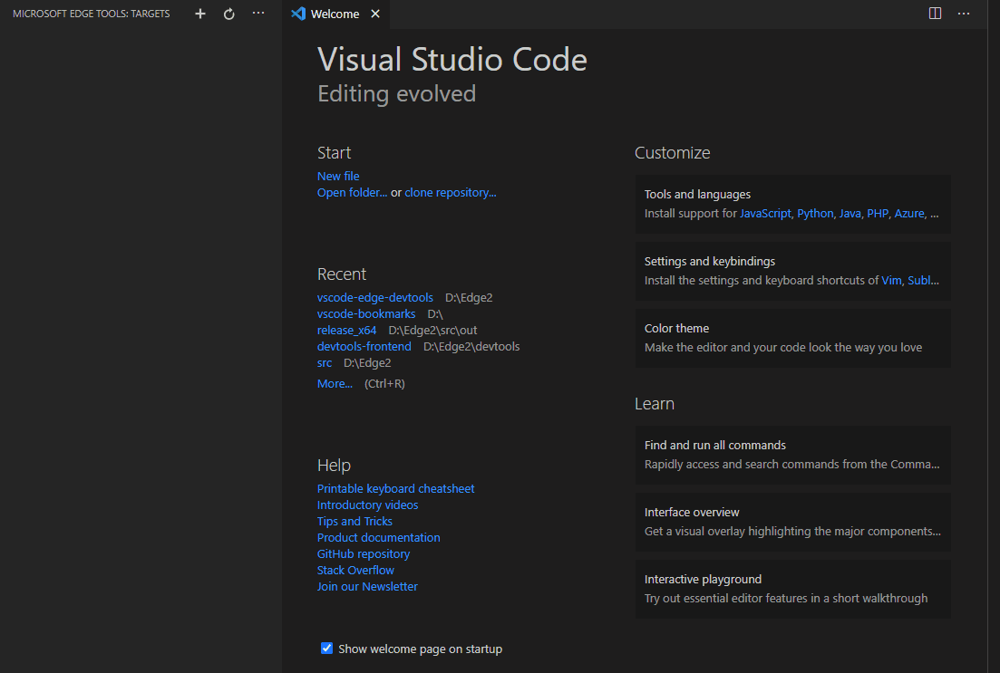
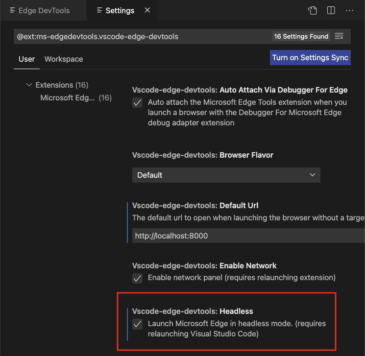
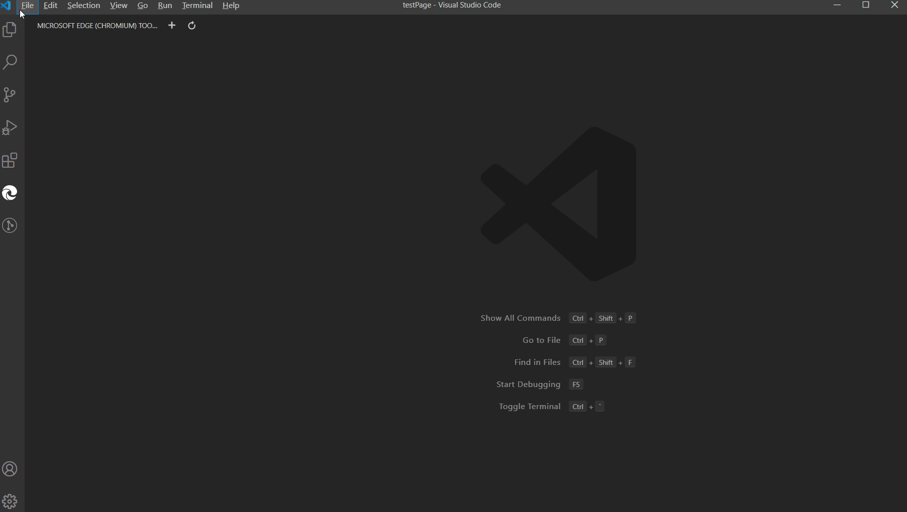

# Changing Extension Settings

You can customize the extension to your needs. From version 1.1.6 onwards you can reach the Settings and read the Changelog via the `…` button of the sidebar.

## Turning on Headless Mode

By default, the extension will launch the browser in its own window. This means you get an extra browser icon in your task bar and you need to turn on casting to see the browser inside the editor. You can also choose "headless mode" to not have the browser open in an own window, but embed itself directly into Visual Studio Code.

**Note**: In the past we had issues on Macintosh computers where the Microsoft Edge instance reported itself as "inactive" when the window wasn't visible. Using headless mode fixes that problem.

You can see an example of the change in the following screencast:

## Toggling Network Inspection

By default, the extension will show the Network Network Pane to inspect any network request of the attached browser. If you don't want this, you can turn it off in the settings and restart the extension.

Go [back to documentation](./index.md)
